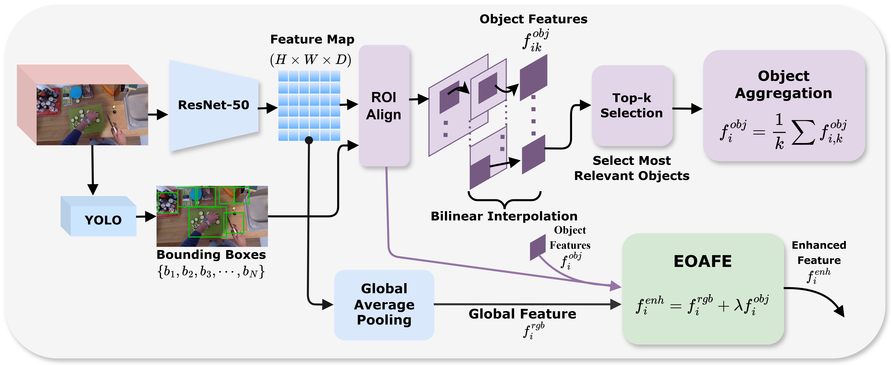

# EgoCAMRA
we propose a multimodal graph-based framework EgoCAMRA (Egocentric Confidence-Aware Residual Random Walks for Multi-Action Recognition and Anticipation) for recognition of multiple co-occurring actions and anticipation in egocentric videos.

## Problem Formulation

## Our Proposed Architecture (EgoCAMRA)

## Egocentric Object-Aware Feature Enhancement Module (EOAFE)

1. We propose an EOAFE module that localizes hand--object interaction regions via ROI Align and spatial confidence weighting, combined with multimodal adaptive fusion of RGB and optical flow for discriminative multi-action representations.
2. We construct a Sparse Temporal Similarity Graph (STSG) over enhanced multimodal features using combined feature-level and object-aware similarity with k-NN sparsification for efficient temporal graph modeling.
3.  We propose a Confidence-Aware Residual Random Walk (CARRW) that selectively refines multi-label predictions by preserving high-confidence ones while updating uncertain ones, naturally extended to parameter-free action anticipation.
4. We extensively evaluate our framework on three egocentric datasets EPIC-Kitchens, ADL, and Charades. Our method achieves superior performance compared to state-of-the-art approaches in both action recognition and action anticipation.
